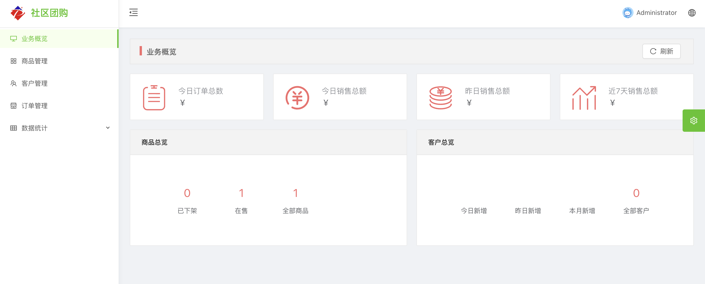

# 社区团购后台管理系统

## 简介
社区团购后台管理系统致力于打造一个简捷、轻便、可单机部署的后台管理系统。其使用前后端分离的架构，使用下面的技术来实现。

**后端技术**

|       技术       |   说明    |                      官网                       |
|:--------------:|:-------:| :---------------------------------------------: |
|   SpringBoot   |  开发框架   |     https://spring.io/projects/spring-boot      |
| Spring WebFlux | 响应式服务框架 |     https://spring.io/reactive     |
|     MySQL      |  关系数据库  | https://www.mysql.com/ |

**前端技术**

|     技术     |    说明    |        官网         |
|:----------:| :--------: |:-----------------:|
|    Vue     |  前端框架  | https://vuejs.org |
| Ant Design | 前端UI框架 |     https://ant.design/index-cn      |

## 项目搭建

### 本地编译及运行
```
yarn install
```
```
yarn serve 
```

### 发布编译
```
yarn build 
```

## 项目演示

演示地址：[http://49.232.164.83/]()

用户名：admin/hello123

#### 主页面



## 联系方式

邮件地址：lijianq@live.com

微信号：lijianqiang452330